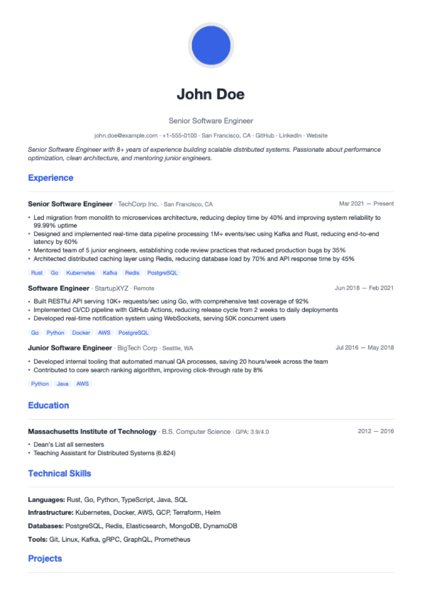
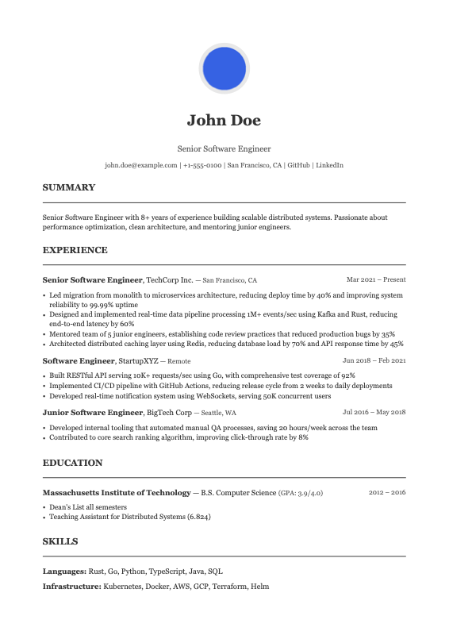
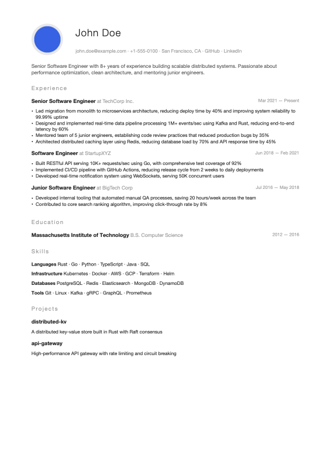
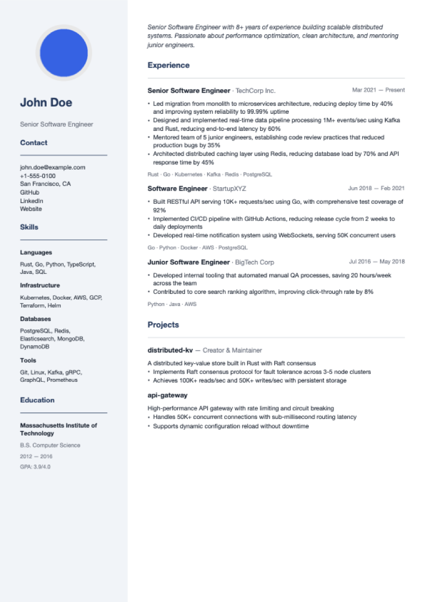
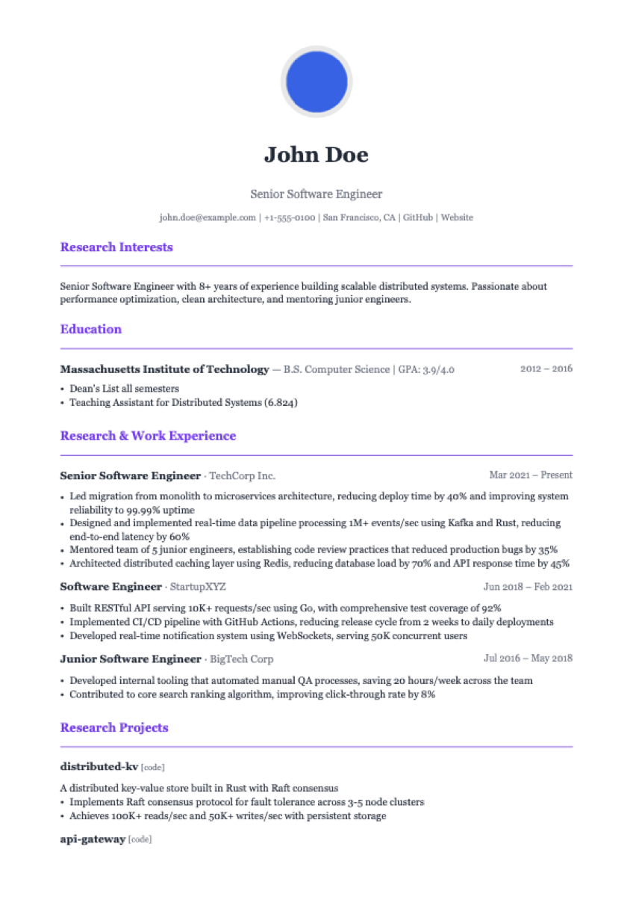

<div align="center">

# CodeResume

**AI-powered resume generator for tech professionals**

[](https://github.com/ruiyli/CodeResume/actions/workflows/ci.yml)
[](LICENSE)
[](https://www.rust-lang.org/)

[English](#features) | [中文](#中文说明)

</div>

---

CodeResume is a CLI tool that generates beautiful, ATS-friendly PDF resumes from YAML/JSON data. It features AI-powered content optimization via Claude or OpenAI, 5 professional Typst templates, and full Chinese/English bilingual support.

## Demo

<table>
<tr>
<td><b>Modern</b></td>
<td><b>Classic</b></td>
<td><b>Minimal</b></td>
<td><b>Two-Column</b></td>
<td><b>Academic</b></td>
</tr>
<tr>
<td></td>
<td></td>
<td></td>
<td></td>
<td></td>
</tr>
</table>

## Features

- **5 Professional Templates** — Modern, Classic, Minimal, Two-Column, Academic
- **AI Enhancement** — Smart rewriting, JD matching, scoring & suggestions (Claude / OpenAI)
- **Bilingual** — Full Chinese & English support with proper font rendering
- **Photo Support** — Circular avatar in resume header
- **Multiple Formats** — PDF (via Typst) + Markdown output
- **Data-driven** — YAML/JSON resume data, easy to version control
- **Fast** — Native Rust performance, sub-second PDF generation

## Quick Start

### Prerequisites

- [Rust](https://rustup.rs/) 1.75+
- [Typst](https://typst.app/) 0.11+ (`brew install typst` on macOS)

### Install

```bash
git clone https://github.com/ruiyli/CodeResume.git
cd CodeResume
cargo build --release
```

### Create Your Resume

**Option A: Write a YAML file**

```bash
cp sample-data/example-en.yaml my-resume.yaml
# Edit my-resume.yaml with your info
```

**Option B: Interactive wizard**

```bash
cargo run -- new --output my-resume
```

### Generate PDF

```bash
# Default template (modern)
cargo run -- generate my-resume.yaml --output my-resume --format pdf

# Choose a template
cargo run -- generate my-resume.yaml --output my-resume --format pdf --template minimal

# Generate both PDF and Markdown
cargo run -- generate my-resume.yaml --output my-resume --format pdf --format markdown
```

### AI Features (optional)

```bash
# Configure API key
cargo run -- config set ai.api_key sk-your-key-here
# Or: export ANTHROPIC_API_KEY=sk-your-key-here

# AI-optimize your resume
cargo run -- optimize my-resume.yaml

# Tailor to a job description
cargo run -- tailor my-resume.yaml --jd job-description.txt

# Get AI scoring & feedback
cargo run -- review my-resume.yaml
```

## Resume Data Format

```yaml
version: "1.0"
language: en                    # en | zh
personal:
  name: "John Doe"
  email: "john@example.com"
  phone: "+1-555-0100"
  title: "Senior Software Engineer"
  photo: "photo.jpg"           # Optional avatar
  github: "https://github.com/johndoe"

summary: "8+ years building distributed systems..."

experience:
  - company: "TechCorp"
    title: "Senior Engineer"
    start_date: { year: 2021, month: 3 }
    highlights:
      - "Led migration to microservices, reducing deploy time by 40%"
    technologies: ["Rust", "Kubernetes"]

education:
  - institution: "MIT"
    degree: "B.S. Computer Science"
    start_date: 2012
    end_date: 2016

skills:
  groups:
    - category: "Languages"
      skills: ["Rust", "Go", "Python"]
```

See [sample-data/](sample-data/) for complete examples.

## Commands

| Command | Description | Needs AI |
|---------|-------------|:--------:|
| `coderesume new` | Interactive resume creation | - |
| `coderesume generate <file>` | Generate PDF/Markdown | - |
| `coderesume templates` | List available templates | - |
| `coderesume config` | Manage configuration | - |
| `coderesume optimize <file>` | AI-powered rewriting | Yes |
| `coderesume tailor <file> --jd <jd>` | JD-matching optimization | Yes |
| `coderesume review <file>` | AI scoring & suggestions | Yes |

## Templates

| Template | Style | Best For |
|----------|-------|----------|
| **modern** | Clean, blue accents | Tech companies, startups |
| **classic** | Traditional serif | Enterprise, finance |
| **minimal** | Ultra-clean whitespace | Senior engineers |
| **two-column** | Sidebar layout | Dense information |
| **academic** | Education-first | Research, academia |

All templates support Chinese and English with proper font rendering.

## Architecture

CodeResume is built as a 7-crate Rust workspace:

```
cr-cli → cr-service → cr-ai    → cr-core
                    → cr-io    → cr-core
                    → cr-render → cr-core
         cr-config
```

| Crate | Purpose |
|-------|---------|
| `cr-core` | Data types (Resume, Scoring, JD) |
| `cr-config` | TOML configuration management |
| `cr-io` | YAML/JSON/Markdown file I/O |
| `cr-ai` | AI provider abstraction (Claude + OpenAI) |
| `cr-render` | Typst template engine + PDF generation |
| `cr-service` | Business logic orchestration |
| `cr-cli` | CLI entry point (clap + inquire) |

## Contributing

Contributions are welcome! Please feel free to submit issues and pull requests.

1. Fork the repository
2. Create your feature branch (`git checkout -b feature/amazing-feature`)
3. Run tests (`cargo test --workspace`)
4. Run lints (`cargo clippy --workspace`)
5. Commit and push
6. Open a Pull Request

## License

This project is licensed under the MIT License - see the [LICENSE](LICENSE) file for details.

---

## 中文说明

CodeResume 是一个面向技术岗位求职者的 CLI 智能简历生成工具。

### 特性

- **5 套精美模板** — 现代、经典、极简、双栏、学术
- **AI 增强** — 智能润色、JD 匹配、评分建议（支持 Claude / OpenAI）
- **中英双语** — 完整中文支持，苹方/宋体等系统字体渲染
- **照片支持** — 圆形头像显示
- **多格式输出** — PDF (Typst) + Markdown
- **数据驱动** — YAML/JSON 格式，方便版本管理

### 快速开始

```bash
# 安装依赖
brew install typst     # macOS
cargo build --release

# 用示例数据生成中文简历
cargo run -- generate sample-data/example-zh.yaml --output 我的简历 --format pdf

# 查看所有模板
cargo run -- templates
```

### AI 功能

```bash
# 配置 API Key
export ANTHROPIC_API_KEY="sk-ant-xxx"

# AI 润色
cargo run -- optimize my-resume.yaml

# 针对 JD 优化
cargo run -- tailor my-resume.yaml --jd 职位描述.txt

# AI 评分
cargo run -- review my-resume.yaml
```
